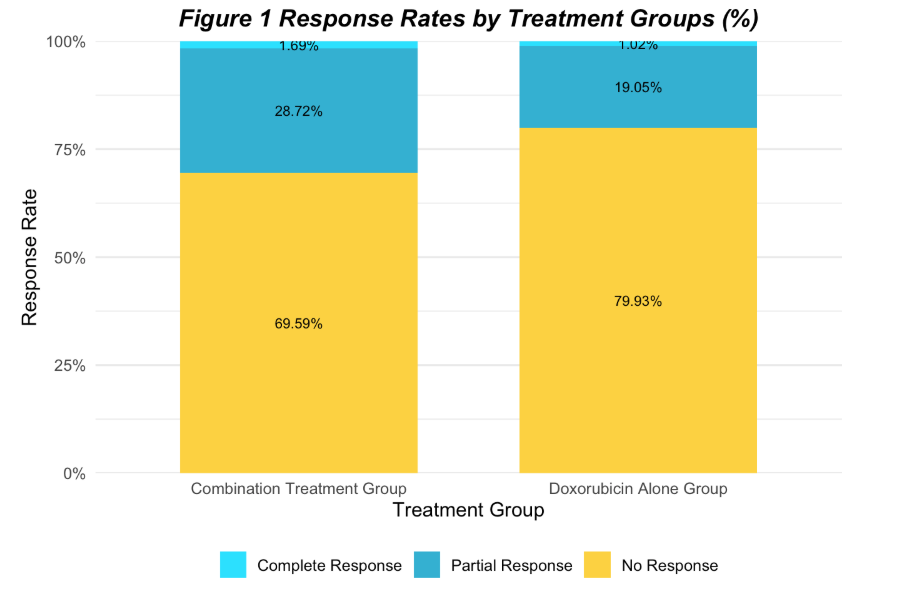
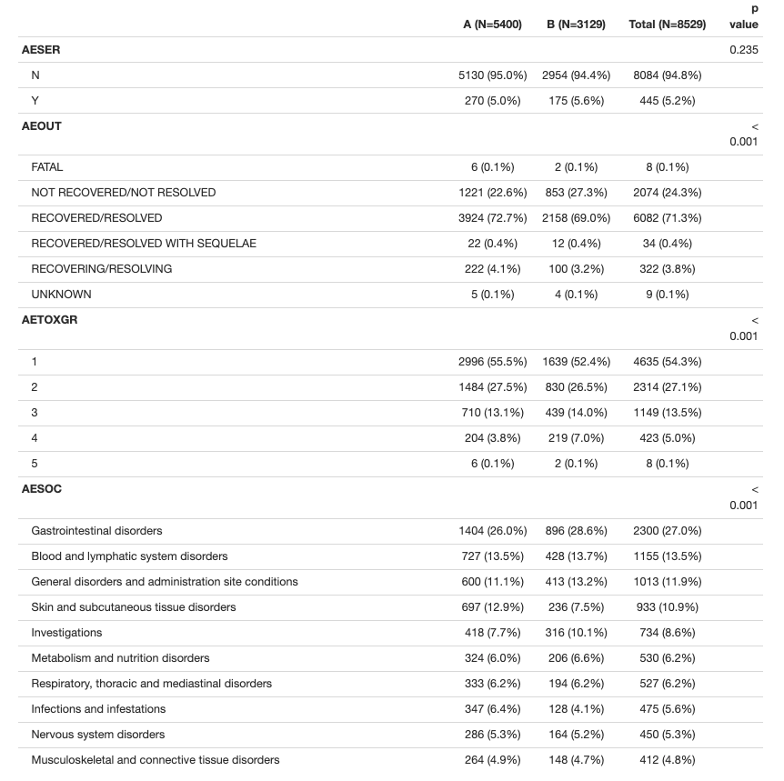

# Clinical Trial in Soft Tissue Sarcoma (SARC021) — Data Analysis

**Author:** Yueqi Feng  
**Institution:** Weill Cornell Medicine
**Note:** This is a group project completed in collaboration with Roland Hentz, Zihan Yang, and Haojia Li.

## 📌 Project Overview
This project analyzes data from the SARC021 clinical trial, which compared the efficacy and safety of **doxorubicin + evofosfamide** versus **doxorubicin alone** in patients with advanced soft tissue sarcoma (STS).

The analysis includes:
- **Baseline characteristics comparison** between the two treatment arms.
- **Best and last tumor response rate** analysis according to RECIST v1.1.
- **Adverse event (AE) profile** comparison across arms, including severity (toxicity grade), recovery outcome, and top 10 AE system organ classes.
- Stratified analyses by **cancer stage** and **patient age groups**.
- Visualization of **response rates** and **AE distribution**.

Data cleaning, preprocessing, statistical testing, and plotting were performed using **R**.

---

## 📂 Repository Structure
01_data/        # Raw datasets (Excel format) and data dictionary
02_docs/        # Project background and instructions
03_code/        # R scripts / RMarkdown for analysis
04_reports/     # Final project presentation and report
05_results/     # Generated analysis outputs (HTML, plots, tables)
06_src/         # Source code or additional scripts

---

## 🔍 Key Analyses

### 1. Baseline Comparison
- Used **Fisher’s Exact Test** for categorical variables.
- **Kruskal-Wallis test** for age distribution (non-normal).

### 2. Tumor Response
- Re-categorized tumor responses into:
  - **Complete Response (CR)**
  - **Partial Response (PR)**
  - **No Response** (includes SD, PD, NE)
- Found **higher objective response rate (ORR)** in the combination treatment group (28.7%) vs. doxorubicin alone (18.4%), *p = 0.00222*.

### 3. Adverse Events
- AE profile summarized by:
  - Serious AE status (AESER)
  - Recovery outcome (AEOUT)
  - Toxicity grade (AETOXGR)
  - System organ class (AESOC)
- Identified differences in AE severity and distribution between arms.

### 4. Stratified Analyses
- By **cancer stage**: Stage I & III showed significantly lower serious AE rates in combination therapy.
- By **age group**: Older patients tended to have more severe AEs in doxorubicin alone arm.

---

## 📊 Main Figures
### **Figure 1 — Response Rates by Treatment Groups**

**Interpretation:**  
Combination therapy showed a higher Objective Response Rate (**28.7%**) compared with doxorubicin alone (**18.4%**), *p = 0.00222*.

### **Adverse Event Profile Comparison**

| Characteristic | Combination (A) | Doxorubicin Alone (B) | p-value |
| --- | --- | --- | --- |
| **Serious AE (AESER)** | 5.0% | 5.6% | 0.235 |
| **Recovered/Resolved (AEOUT)** | 72.7% | 69.0% | <0.001 |
| **Toxicity Grade 4–5** | 3.9% | 7.1% | <0.001 |
| **Top AE — Gastrointestinal Disorders** | 26.0% | 28.6% | <0.001 |

> Full AE breakdown available in `Final_results.html`.

---

## 🛠 Dependencies
See `requirements.txt` for full R package list.

---

## 📄 License
This project is distributed under the terms of the MIT License. See `LICENSE.txt` for details.

---

## 📚 References
Key references from clinical trial background and RECIST methodology are listed in the `Final_Report_G12.pdf`.

---